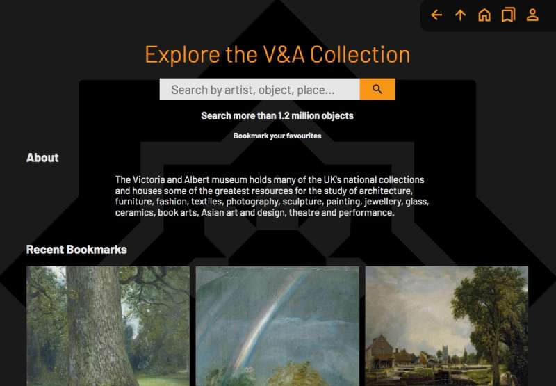
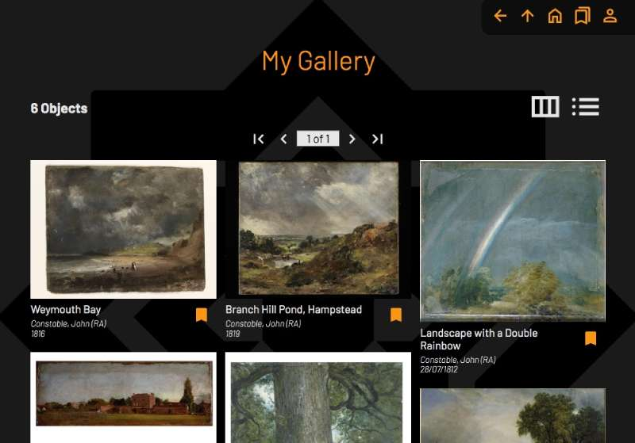
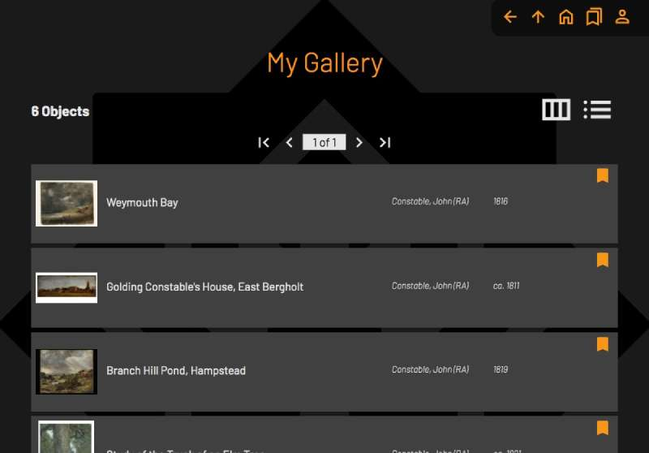
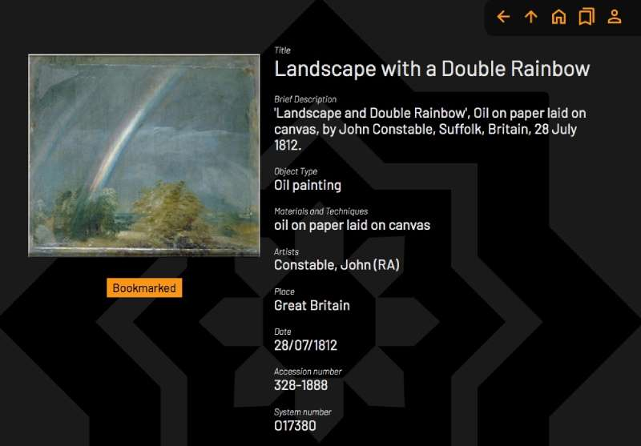
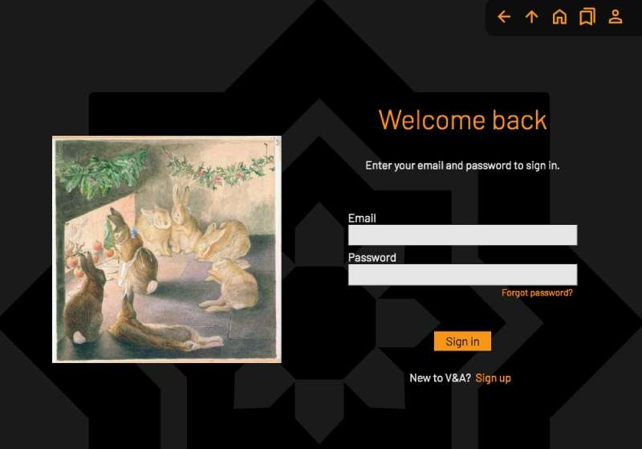

# V&A Art Collection

A responsive website where you can search the art collection of the Victoria and Albert museum.

Created with React, React Router, Firebase and SASS.

Developed and end-to-end tested with Cypress.

## Features:

### Search

- Search the collection using the
  museum's API.

  Documentation at:

  https://api.vam.ac.uk/docs

  https://developers.vam.ac.uk/

- Search parameters and pagination changes the query string in the address URL. This is handled with React Router's useSearchParams hook.

### Display items

- Display search results in Gallery or List layout.

- Search results are paginated, navigate using the arrow buttons. Also clicking on the page number allows you to type in the page number.

- An Item page that shows the detailed information of each art object. The URL address of an item page has the format ../item/O1259772 where 'O1259772' is the system number of the object (handled with React Router useParams hook).

- Clicking the image on the Item page opens a modal and displays the image at fullscreen.

### Save favourites

- Bookmark objects by clicking on the bookmark icon next to each image.

- My Gallery page presents all your bookmarked objects.

- Home page shows recently bookmarked items and featured artists.

- Bookmarks are saved in local storage if there is no registered user.

### Create an account

- To save and view your bookmarks on multiple devices, create an account on the sign-up page.

- Users and bookmarks are handled with Firebase/Cloud Firestore.

- The navigation bar 'User icon' shows the user status and name.

- Login/Logout/PasswordReset/Register pages.

### Misc

- Responsive website and image resolutions.

- Custom useAxios and useLocalStorage hooks.

- Global state management with useContext hook.

- Restrict access to specific pages when user is signed in or out using wrapper components - noUserRoute and userOnlyRoute.

- Navigation icons are "Go back", "Go to top of screen", "Home page", "My Gallery Page" and "User status and navigation links to Login and Create new account pages".

## Instructions

To run in development mode:

```
npx vite
```

To build for production:

```
npx vite build
```

To open Cypress testing app:

```
npx cypress open
```

Website requires the following environment variables for Firebase to work:

```
VITE_FIREBASE_API_KEY
VITE_FIREBASE_AUTH_DOMAIN
VITE_FIREBASE_PROJECT_ID
VITE_FIREBASE_STORAGE_BUCKET
VITE_FIREBASE_MESSAGING_SENDER_ID
VITE_FIREBASE_APP_ID
```










